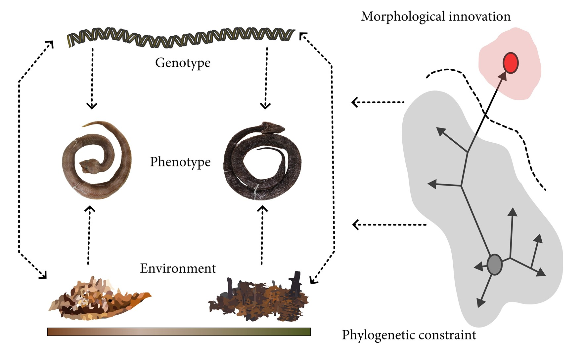

# Morphological change occurred by phylogenetic context, not by ecological divergence in Neotropical hognose pitvipers

**Carlos Patron-Rivero\***, Kevin López-Reyes, Citlalli Edith Esparza-Estrada, Sara Ruane, Diego Jose Santana, Carlos Yañez-Arenas, & Uriel Rodríguez-Palacios

  

## Abstract

Speciation involves complex interactions among genetic, ecological, and morphological evolution, yet these axes often evolve asynchronously, especially in lineages with phylogenetic constraints. Neotropical hognose pitvipers (*Porthidium*) inhabit diverse environments but show limited morphological variation despite ecological divergence. Here we quantified morphological disparity using geometric morphometrics across 484 specimens belonging to eight species, and assessed ecological niche divergence via climatic niche modeling within a phylogenetic framework. Here we quantify centroid size (Csize) and head shape of *Porthidium* species and test whether species-level morphological disparity is accompanied by ecological niche divergence and/or phylogenetic divergence. We fitted competing models M0: null, M1: ecology-only, M2: phylogeny-only, and M3: ecology + phylogeny; and ranked them by logLik and AICc, and assessed significance with Mantel tests and multiple regression on distance matrices. Size disparity was strongly accompanied by phylogenetic divergence (Mantel r = 0.70, *p* = 0.011; MRM partial effect *p* = 0.013, R² = 0.49; AICc weight = 0.78). In contrast, shape disparity was not accompanied by either ecological or phylogenetic divergence (null model best supported), and combined morphological disparity was likewise unexplained. Ecological divergence itself was independent of phylogenetic distance (r = −0.25, *p* = 0.89), indicating that the absence of an ecological signal is not an artefact of collinearity between ecology and ancestry. We conclude that Csize differences among *Porthidium* species accumulate in a time-dependent, phylogenetically structured mode, whereas shape differences are decoupled from both niche divergence and shared ancestry, suggesting a role for unmeasured ecological axes, sexual or allometric variation, and lineage-specific contingencies.

**Keywords:** Ecological divergence, Morphological disparity, Cryptic evolution, Adaptive radiation, Viperidae, Evolution

## Citation

Patron-Rivero, C., López-Reyes, K., Esparza-Estrada, C. E., Ruane, S., Santana, D. J., Yañez-Arenas, C., & Rodríguez-Palacios, U. (2026). *Morphological change occurred by phylogenetic context, not by ecological divergence in Neotropical hognose pitvipers (Viperidae: Crotalinae).* Submitted.
